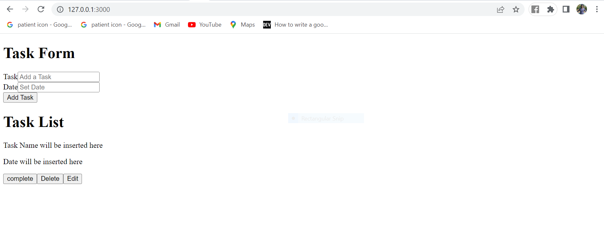

# Rendering Preact components in an Astro page

Astro pages handles routing, data loading and overall page layout for every page in a website. Astro pages live in the `src/pages/` subdirectory of the Astro project.
Astro pages uses `.astro` file extension. They have the same features as Astro components where it has `component script` and `component template`.

This is how an Astro component looks like:

```
---
// Component Script (JavaScript)
---
<!-- Component Template (HTML + JS Expressions) -->

```

Astro page also takes the same structure as an Astro component.

To render the `TaskForm` and `TaskList` component, I’ll first import it to `index.astro` page, think of `index.astro` file as `index.html` which can be like a home page. The two components can be made interactive(hydrated) by using Astro `client:` directive. These are components attributes that determine when your components Javascript should be sent to the browser. 

I’ll be using `client:visible` directive, which means Astro is going to load Javascript to guarantee interactivity, but only serve it when needed. Since I’ll use javascript on the two components, it’s important for me to include this directive to make the two components interactive.

If I do not include the `client:visible` directive, then the form will not do anything when I click a button since there is no Javascript sent to the browser. I have not yet added Javascript to the two components, but I’ll do it in the next steps.

For more information on client directives, you can refer to this reference: https://docs.astro.build/en/reference/directives-reference/#client-directives

The `index.astro` file will look like this.

```

---
import TaskForm from '../components/TaskForm.jsx'
import TaskList from '../components/TaskList.jsx'
---


<html lang="en">
    <head>
        <meta charset="utf-8" />
        <link rel="icon" type="image/svg+xml" href="/favicon.svg" />
        <meta name="viewport" content="width=device-width" />
        <meta name="generator" content={Astro.generator} />
        <title>Astro</title>
    </head>
    <body>
        <div>
            <TaskForm client:visible />
        </div>
        
        <div>
            <TaskList client:visible />
        </div>


    </body>
</html>

```

I will start the development server by running this command `npm run dev` and I will see both components rendered and it will display content as shown in the image below:




