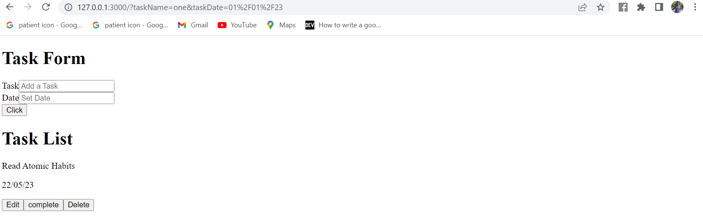

# Rendering the Tasks

In order to display the tasks that I have created, I will need to map through the `tasks` store and then return each `task` that is created by displaying the task name and the task date. I’ll head over to the `TaskList.jsx` file and then use the `useStore` hook to read the store values

```

const $task = useStore(task)
const $tasks = useStore(tasks)

```

I will add this code below to map through my task store and then render the task that is added to the list.

```

<div>
        <h1>Task List</h1>
      </div>
      <div>
        {$tasks.map((task) => {
          return (
            task && (
         <li style={{listStyleType: "none"}}>
              <div key={task._id}>
                <div>
                  <p>
                    {task.taskName}
                  </p>
                  <p>
                    {task.taskDate}
                  </p>
                </div>


                <div>
                  <div>
                  <button>Edit</button>
                   
                   <button>
                      complete
                    </button>


                    <button>Delete</button>
        
                  </div>
                </div>
              </div>
            </li>
            )
          );
        })}
      </div>


```

I am using the `task &&` in my code, so that I can only render `task` in my application if it exists. When a task is submitted, it will display the task name and the task date which will have three buttons to edit a task, to mark a task as completed and to delete a task.

Then I’ll create a `setTask` function that will update the state of the task stored in the `nanostore` task. 
Inside the `setTask` function, the `task.set()` method is called with the `t` parameter. This replaces the current task object in the Nanostore with the new task object passed to the function.

The function will look like this:

```

 const setTask = (t) => {
        task.set(t)
    }

```

The `setTask` function will be called when the Edit button is clicked.

```
<button onClick={() => setTask(task)}>Edit</button>
```

It’s testing time! I’ll start my development server by running `npm run dev` and go to my web browser to test it out. If I submit my task details by clicking the button, I’ll see the task details rendered in the app. When I click the ‘Edit’ button, it will pre-fill the task name and date in the input fields. If I modify the task name as an example and then click the button, I will see the task name is updated. Voila! It works like a charm.

In the image below you can see the task is created and rendered.


